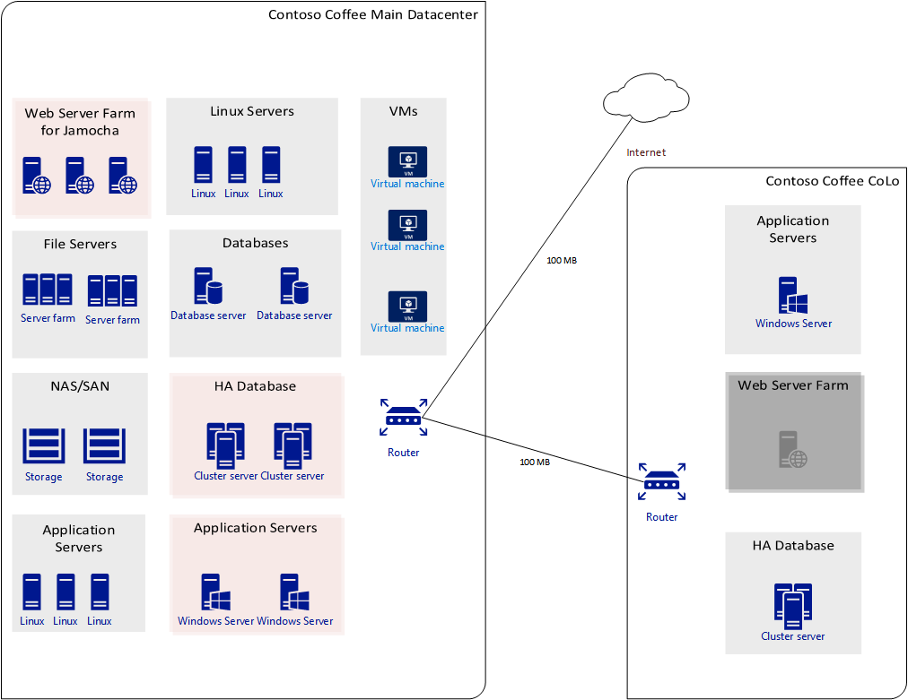

# Azure Hackathon Case Study

## The Contoso Coffee Story
Contoso Coffee is a rapidly growing company that operates in the US as well as several  international markets within the EU. They have built their business from the ground up and recently purchased a small startup company named Small Beans that resides in western US states where Contoso Coffee previously had no presence. They have staff that are mobile, working with their customers at their locations as well as with suppliers in remote locations around the world.

Senior Leadership wants to elevate their brand and market share as a result of acquiring Small Beans, however they are risk adverse and realize the challenges involved in managing both a complex merger as well as growing the business into new markets.
Their key strategy to achieve these goals is to make the company more agile by reducing capital expenditures and stabilizing operational costs.  They plan to consolidate and relocate warehouses to new low-cost locations and want to leverage the unique brand that Small Beans has by promoting that line of products to Contoso Coffee customers.  The plan to make the workforce more mobile in order to be as competitive as possible. Senior leadership has tasked the CTO and CIO to strategize on IT solutions that will align to their key strategy.

## Contoso Coffee Infrastructure 
Contoso Coffee has been in business for over 20 years and has 100% of their IT resources on-premises located within a main data center and a co-location, both on the US Eastern seaboard.  Contoso Coffee's infrastructure is diverse. It is hosted on several different platforms and the recent purchase of Small Beans has added to their infrastructure diversity and complexity.

The datacenter and colo are connected via a 100MB MPLS circuit that is highly saturated.  There’s also a 100MB MPLS circuit to the Internet from the main data center.  Via this route employees’ VPN into Contoso Coffee and customers access a web application to order products.   
The colo is primarily used as a hot-standby facility for mission-critical workloads since it’s a much smaller footprint compared to the main datacenter.  Contoso accepts non-mission-critical workloads to be unavailable in the event of a disaster.

## Contoso Coffee Applications
The primary application that runs the business for Contoso Coffee is a three-tier client/server application named Jamocha that employees access from a thick desktop application and customers access via a web application.

The following solution components that supports Jamocha are considered mission critical: 
* the web server farm, HA database, and Windows application servers.

One of Contoso Coffee's main competitors recently had a data breach after their mobile app platform was compromised due to a vulnerability in their hosting provider. This gave external parties access to data that should have not been accessible.  Contoso Coffee does not want to experience a similar breach and is reluctant to embrace a mobile app solution. Their CIO wants to add an additional layer of security to elements of their IT environment.

## Small Beans Infrastructure
Small Beans is a startup company that was born in the cloud.  They have no IT infrastructure on-premises other than a few printers, a wireless access point, and a router that connects their  small office to the Internet.  Their employees are highly mobile and primarily work from the field or their home office.

Employees at Small Beans are incredibly happy with the performance and stability of their network.  Outages have been far and few between.  The systems always seems to run and run well whenever they need it.

## Small Beans Applications
The primary application that runs the business for Small Beans is a web application named Caffeine that both employees and customers access via a web browser.

### Next Generation Infrastructure (NGI)
You have met with the CTO and her directs to get an understanding of their desired future state solution named NGI.  For the last month you have been running Azure Migrate to assess their VMware environment and they just emailed the report to you.

You have an Architectural Design Session coming up in a few weeks and you want to prepare for that meeting.  You captured the following salient points during your discovery meetings with the IT staff:
* The team expects that 50% or more of their infrastructure will reside in Azure once NGI is complete.
* The existing datacenter has physical capacity however the CFO has strongly urged the CTO to avoid any new capital expenditures.
* Jamocha will be the new company-wide standard application.  Jamocha must:
    * Be globally distributed (mainly US and EMEA).
    * Be highly available in the event of an Internet failure.
    * Be scalable to meet fluctuating market demands.
* The team must decommission its colo facility as part of NGI.
* Reduce their on-prem HA/DR solutions by building as much HA and DR into solution elements in the cloud.
* The solution must be secured using recommended practices.
 
## Solution Design
As the Cloud Solution Architect assigned to the deal you are tasked to develop a conceptual and logical architecture of the solution as well as a  budgetary estimate of costs.  There are several solution elements the CTO and her directs want to vet during Architectural Design Session:
1) Jamocha 
2)	Colo retirement 
3)	Hybrid Connectivity 
4)	Resiliency in the cloud
5)	Security

For this exercise a  Conceptual architecture is a structural design that contains no implementation details. Logical architecture gives as much detail as possible providing detailed specifications.

You will present your solution design with a goal of getting approval from the customer to build the solution in a Proof of Concept.

## Azure Hackathon Diagram
Here's a diagram of the existing Contoso and Small Beans  architecture.

[Back](index.md)